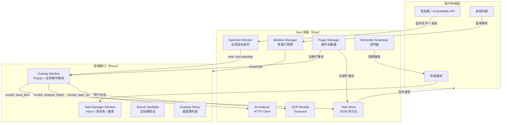
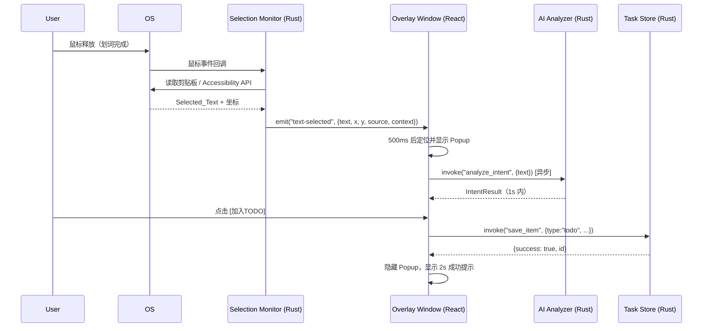

# 技术设计文档：text-selection-task-manager

## 概述

本文档描述桌面端划词任务管理工具的技术设计。该工具基于 **Vite + React + Tauri + TypeScript + TailwindCSS** 构建，核心能力是在用户于任意桌面应用中划选文字后，在光标附近弹出极简半透明 Popup，让用户一键将内容分类保存为任务、便签、高亮或稍后阅读等条目，并自动附加来源与上下文信息。

系统还提供 OCR 截图识别、AI 意图识别、全局搜索台、桌面便利贴、定时通知提醒和插件模块等高级功能，帮助用户在阅读或工作过程中高效捕获、整理和回顾信息。

### 技术栈

| 层次 | 技术 | 版本 |
|------|------|------|
| 前端框架 | React | `^19.2.4` |
| 构建工具 | Vite（Rolldown 驱动，Rust 原生速度） | `^8.0.4` |
| 样式 | TailwindCSS v4（CSS-first 配置，`@theme` 替代 config.js） | `^4.x` |
| 桌面运行时 | Tauri v2 | `^2.x` |
| 原生后端 | Rust（Tauri 插件 + 自定义命令） | — |
| 本地存储 | JSON 文件（`app_data_dir`） | — |
| OCR | Tesseract（通过 Rust 绑定） | — |
| AI | 可配置 HTTP API（OpenAI 兼容接口） | — |
| 颜色工具 | chroma.js（自定义主色 OKLCH 派生） | `^3.x` |
| 状态管理 | Zustand（轻量，无 Provider 样板） | `^5.x` |
| 异步数据 | TanStack Query v5（缓存 + 乐观更新） | `^5.x` |

### NPM 第三方库清单

不重复造轮子，按功能模块选用最合适的库：

#### 路由

| 库 | 用途 | 选用理由 |
|----|------|---------|
| **TanStack Router** | Task Manager Window 内部页面路由（Inbox / 项目夹 / 设置 / 插件管理） | 全类型安全路由，search params 自动类型推断，文件路由约定，与 TanStack Query 同生态；Overlay/Spotlight/Sticky 窗口为单页无需路由 |

> 路由策略：Task Manager Window 使用 TanStack Router 管理多视图（`/inbox`、`/project/:id`、`/settings`、`/plugins`）；其余三个窗口（Overlay、Search Spotlight、Desktop Sticky）均为单页组件，不引入路由。

---

#### UI 组件基础

| 库 | 用途 | 选用理由 |
|----|------|---------|
| **shadcn/ui** | 基础组件（Button、Dialog、Popover、Input、Checkbox、Badge 等） | 代码复制到项目中完全可控，基于 Radix UI + TailwindCSS v4，shadcn 已支持 Tailwind v4 + OKLCH |
| **Radix UI Primitives** | 无障碍原语（`@radix-ui/react-*`） | shadcn/ui 底层，键盘导航、ARIA 开箱即用 |
| **cmdk** | Search Spotlight 命令面板 | 专为 Raycast 风格搜索台设计，键盘导航完善，shadcn/ui 已集成 |
| **Lucide React** | 图标库 | shadcn/ui 默认图标方案，SVG 按需引入，Tree-shaking 友好 |

#### 动画与交互

| 库 | 用途 | 选用理由 |
|----|------|---------|
| **Motion（原 Framer Motion）** | Popup 出现/消失动画、便利贴拖拽、列表项动画 | React 19 兼容，`layout` 动画自动处理列表重排，`AnimatePresence` 处理卸载动画 |
| **@dnd-kit/core** | Inbox 条目拖拽排序、拖入项目夹 | 轻量、无障碍、支持触摸，替代重量级 react-beautiful-dnd |
| **react-hotkeys-hook** | 全局快捷键（Ctrl+D、Alt+Space、Escape 等） | 声明式 Hook，支持 Tauri 全局快捷键场景 |

#### 数据展示

| 库 | 用途 | 选用理由 |
|----|------|---------|
| **@tanstack/react-virtual** | Inbox 长列表虚拟滚动 | 与 TanStack Query 同生态，条目多时保持 60fps |
| **date-fns** | 时间格式化（"3分钟前"、"YYYY-MM-DD HH:mm"） | Tree-shaking 友好，无全局副作用，替代 moment.js |
| **fuse.js** | 前端模糊搜索（Search Spotlight 本地检索） | 零依赖，支持权重字段，适合离线全文搜索 |

#### 通知与反馈

| 库 | 用途 | 选用理由 |
|----|------|---------|
| **Sonner** | 应用内 Toast 通知（保存成功/失败提示） | shadcn/ui 官方推荐，已废弃内置 toast 转向 Sonner，支持 promise toast |
| **vaul** | 移动端风格抽屉（条目详情面板） | shadcn/ui 集成，底部滑入动画，适合详情展开场景 |

#### 表单与输入

| 库 | 用途 | 选用理由 |
|----|------|---------|
| **react-hook-form** | 设置页表单（API Key、快捷键配置） | 与 React 19 Actions 兼容，零受控组件，性能最优 |
| **zod** | 表单校验 + Tauri 命令返回值类型校验 | TypeScript-first，与 react-hook-form 无缝集成 |

#### 工具类

| 库 | 用途 | 选用理由 |
|----|------|---------|
| **chroma.js** | 自定义主色 → OKLCH 色阶派生 | 支持 OKLCH 色彩空间，与 TailwindCSS v4 颜色体系对齐 |
| **clsx + tailwind-merge** | 条件类名合并（`cn()` 工具函数） | shadcn/ui 标准工具，避免 Tailwind 类名冲突 |
| **@vueuse/core 替代：usehooks-ts** | 常用 Hook 集合（useDebounce、useLocalStorage、useMediaQuery 等） | TypeScript 原生，React 19 兼容，避免手写常用 Hook |
| **nanoid** | 生成短 UUID（条目 ID、便利贴 ID） | 比 `crypto.randomUUID()` 更短，URL 安全 |

#### Tauri 官方插件（Rust + JS）

| 插件 | 用途 |
|------|------|
| `@tauri-apps/plugin-notification` | 系统通知推送（定时提醒） |
| `@tauri-apps/plugin-global-shortcut` | 注册全局快捷键（Ctrl+D、Alt+Space） |
| `@tauri-apps/plugin-clipboard-manager` | 读取系统剪贴板获取划词内容 |
| `@tauri-apps/plugin-shell` | 获取当前活跃窗口进程名（来源捕获） |
| `@tauri-apps/plugin-store` | 轻量 KV 存储（设置项持久化，替代手写 JSON） |
| `@tauri-apps/plugin-autostart` | 开机自启动 |

#### 布局与编辑器

| 库 | 用途 | 选用理由 |
|----|------|---------|
| **react-resizable-panels** | Task Manager 主界面侧边栏 + 内容区可拖拽分割 | 6.8M 周下载量，Brian Vaughn（React 核心团队）维护，键盘可访问 |
| **@uiw/react-md-editor** | 便签/笔记条目的 Markdown 编辑与预览 | 轻量，支持暗色主题，无需引入完整富文本编辑器 |

#### 状态管理补充

| 库 | 用途 | 选用理由 |
|----|------|---------|
| **Zustand** | 全局 UI 状态（Popup 显示状态、当前主题、选中条目） | 无 Provider 样板，与 React 19 `use()` 配合流畅 |
| **Immer**（可选） | Zustand 中复杂嵌套状态的不可变更新 | `produce()` 让状态更新写法更直观，避免手动展开嵌套对象 |

#### 开发体验

| 库 | 用途 | 选用理由 |
|----|------|---------|
| **@tanstack/react-query-devtools** | TanStack Query 调试面板 | 开发时可视化缓存状态，生产构建自动 tree-shake |
| **react-error-boundary** | 组件级错误边界（插件崩溃隔离、AI 请求失败降级） | React 19 官方推荐的错误边界方案 |

---


```json
{
  "dependencies": {
    "react": "^19.2.4",
    "react-dom": "^19.2.4",
    "@tauri-apps/api": "^2.x",
    "@tauri-apps/plugin-notification": "^2.x",
    "@tauri-apps/plugin-global-shortcut": "^2.x",
    "@tauri-apps/plugin-clipboard-manager": "^2.x",
    "@tauri-apps/plugin-shell": "^2.x",
    "@tauri-apps/plugin-store": "^2.x",
    "@tauri-apps/plugin-autostart": "^2.x",
    "@tanstack/react-router": "^1.x",
    "@tanstack/react-query": "^5.x",
    "@tanstack/react-virtual": "^3.x",
    "zustand": "^5.x",
    "immer": "^10.x",
    "motion": "^11.x",
    "@dnd-kit/core": "^6.x",
    "@dnd-kit/sortable": "^8.x",
    "cmdk": "^1.x",
    "sonner": "^1.x",
    "vaul": "^1.x",
    "react-resizable-panels": "^2.x",
    "react-hotkeys-hook": "^4.x",
    "react-hook-form": "^7.x",
    "react-error-boundary": "^4.x",
    "@uiw/react-md-editor": "^4.x",
    "zod": "^3.x",
    "date-fns": "^4.x",
    "fuse.js": "^7.x",
    "chroma-js": "^3.x",
    "clsx": "^2.x",
    "tailwind-merge": "^2.x",
    "usehooks-ts": "^3.x",
    "nanoid": "^5.x",
    "lucide-react": "^0.x"
  },
  "devDependencies": {
    "vite": "^8.0.4",
    "@vitejs/plugin-react": "^4.x",
    "@tailwindcss/vite": "^4.x",
    "tailwindcss": "^4.x",
    "typescript": "^5.x",
    "@types/react": "^19.x",
    "@types/react-dom": "^19.x",
    "@types/chroma-js": "^2.x",
    "@tanstack/router-devtools": "^1.x",
    "@tanstack/react-query-devtools": "^5.x",
    "vitest": "^3.x",
    "@testing-library/react": "^16.x",
    "fast-check": "^3.x"
  }
}
```

### React 19 现代用法规范

本项目全面采用 React 19 的新 API，禁止使用已废弃的旧模式：

**新 Hooks 使用规范**

| Hook / API | 用途 | 替代旧模式 |
|-----------|------|-----------|
| `use(promise)` | 在渲染中读取异步资源，配合 `<Suspense>` | `useEffect` + `useState` 数据加载 |
| `useActionState` | 管理异步操作的 pending/error/result 状态 | 手动 `useState` 三件套 |
| `useOptimistic` | 乐观 UI 更新（保存条目时立即反映） | 手动回滚逻辑 |
| `useEffectEvent`（19.2）| 从 Effect 中提取非响应式事件逻辑 | `useRef` 绕过依赖数组 |
| `<Activity>`（19.2）| 隐藏但保留状态的子树（如隐藏的 Popup） | `display:none` + 状态丢失 |
| `ref` as prop | 直接传递 ref，无需 `forwardRef` | `React.forwardRef()` |
| `<form action={fn}>` | 表单直接绑定 async 函数作为 Action | `onSubmit` + `preventDefault` |

**代码示例：保存条目（useActionState + useOptimistic）**

```tsx
// 保存条目 Action，使用 React 19 Actions API
function SaveItemForm({ selectedText }: { selectedText: string }) {
  const [optimisticItems, addOptimistic] = useOptimistic(
    items,
    (state, newItem: Item) => [newItem, ...state]
  )

  const [state, saveAction, isPending] = useActionState(
    async (_prev: State, formData: FormData) => {
      const type = formData.get("type") as ItemType
      // 乐观更新：立即显示新条目
      addOptimistic({ id: "temp", type, text: selectedText, ... })
      // 调用 Tauri 命令持久化
      const result = await invoke("save_item", { type, text: selectedText })
      return { success: true, id: result.id }
    },
    null
  )

  return (
    <form action={saveAction}>
      <button name="type" value="todo" disabled={isPending}>加入 TODO</button>
      <button name="type" value="note" disabled={isPending}>存为便签</button>
    </form>
  )
}
```

**`use()` Hook 读取 Tauri 数据**

```tsx
// 用 use() 配合 Suspense 读取条目列表，替代 useEffect 数据加载
const itemsPromise = invoke<Item[]>("list_items", { inbox: true })

function ItemList() {
  const items = use(itemsPromise) // 在渲染中直接读取，Suspense 处理 loading
  return <ul>{items.map(item => <ItemCard key={item.id} item={item} />)}</ul>
}

// 父组件
function InboxView() {
  return (
    <Suspense fallback={<SkeletonList />}>
      <ItemList />
    </Suspense>
  )
}
```

**`<Activity>` 管理 Popup 状态**

```tsx
// 用 Activity 替代条件渲染，保留 Popup 内部状态（如 AI 建议加载中）
function OverlayWindow() {
  const { isVisible } = usePopupStore()
  return (
    <Activity mode={isVisible ? "visible" : "hidden"}>
      <Popup />
    </Activity>
  )
}
```

### Vite 8 配置规范

Vite 8 使用 Rolldown 作为统一打包器（替代 esbuild + Rollup 双引擎），配置更简洁：

```typescript
// vite.config.ts
import { defineConfig } from "vite"
import react from "@vitejs/plugin-react"
import tailwindcss from "@tailwindcss/vite"

export default defineConfig({
  plugins: [
    react(),
    tailwindcss(), // TailwindCSS v4 Vite 插件，替代 PostCSS 配置
  ],
  resolve: {
    tsconfigPaths: true, // Vite 8 内置 tsconfig paths 支持
  },
  // Rolldown 统一打包，无需分别配置 esbuild/rollup
  build: {
    target: "esnext",
  },
})
```

> Vite 8 关键变化：Rolldown（Rust）替代 esbuild + Rollup，构建速度提升 10-30x；`@tailwindcss/vite` 替代 PostCSS 插件；内置 `tsconfigPaths` 支持。

---

### 浏览器开发模式（Browser Dev Mode）

本地无 Tauri 环境，日常 UI 开发在浏览器中进行，CI/CD 在 GitHub Actions 上编译 Tauri 产物。

#### 核心策略：Tauri API Mock 层

所有 `@tauri-apps/api` 和插件调用通过统一的 `src/lib/tauri.ts` 适配层访问，**禁止在组件中直接 import `@tauri-apps/api`**。适配层根据运行环境自动切换真实实现或 Mock：

```typescript
// src/lib/tauri.ts
const isTauri = () => "__TAURI_INTERNALS__" in window

export async function invoke<T>(cmd: string, args?: Record<string, unknown>): Promise<T> {
  if (isTauri()) {
    const { invoke: tauriInvoke } = await import("@tauri-apps/api/core")
    return tauriInvoke<T>(cmd, args)
  }
  // 浏览器环境：走 mock
  const { mockInvoke } = await import("./mock/invoke")
  return mockInvoke<T>(cmd, args)
}

export async function listen<T>(event: string, handler: (payload: T) => void) {
  if (isTauri()) {
    const { listen: tauriListen } = await import("@tauri-apps/api/event")
    return tauriListen<T>(event, e => handler(e.payload))
  }
  const { mockListen } = await import("./mock/events")
  return mockListen<T>(event, handler)
}
```

#### Mock 数据层

```typescript
// src/lib/mock/invoke.ts
import { MOCK_ITEMS } from "./data"

const store = { items: [...MOCK_ITEMS] }

export async function mockInvoke<T>(cmd: string, args?: Record<string, unknown>): Promise<T> {
  // 模拟网络延迟，让 Suspense/loading 状态可见
  await new Promise(r => setTimeout(r, 150))

  switch (cmd) {
    case "list_items":   return store.items as T
    case "save_item":    { const item = { id: nanoid(), ...args, createdAt: new Date().toISOString() }; store.items.unshift(item as Item); return item as T }
    case "delete_item":  { store.items = store.items.filter(i => i.id !== (args as any).id); return undefined as T }
    case "update_item":  { const idx = store.items.findIndex(i => i.id === (args as any).id); if (idx > -1) store.items[idx] = { ...store.items[idx], ...(args as any) }; return undefined as T }
    case "search_items": return store.items.filter(i => i.text.toLowerCase().includes(((args as any).query ?? "").toLowerCase())) as T
    case "analyze_intent": return { intent: "general", confidence: 0.5 } as T
    case "get_settings": return DEFAULT_SETTINGS as T
    case "save_settings": return undefined as T
    default: throw new Error(`[Mock] Unknown command: ${cmd}`)
  }
}
```

```typescript
// src/lib/mock/events.ts — 模拟划词事件，方便调试 Popup
type Handler = (payload: unknown) => void
const handlers = new Map<string, Handler[]>()

export function mockListen<T>(event: string, handler: (payload: T) => void) {
  if (!handlers.has(event)) handlers.set(event, [])
  handlers.get(event)!.push(handler as Handler)
  return () => { /* unlisten */ }
}

// 浏览器中按 Ctrl+Shift+T 模拟划词事件
if (typeof window !== "undefined") {
  window.addEventListener("keydown", e => {
    if (e.ctrlKey && e.shiftKey && e.key === "T") {
      const payload = { text: "这是一段模拟的划词文本，用于调试 Popup 显示效果。", x: 400, y: 300, source: { type: "unknown" }, context: { before: "", after: "" } }
      handlers.get("text-selected")?.forEach(h => h(payload))
    }
  })
}
```

#### 浏览器开发时的多窗口模拟

Tauri 多窗口在浏览器中用路由页面模拟，通过 URL hash 区分：

```
http://localhost:5173/          → Task Manager Window（主界面）
http://localhost:5173/#overlay  → Overlay Window（Popup 调试）
http://localhost:5173/#spotlight → Search Spotlight 调试
http://localhost:5173/#sticky   → Desktop Sticky 调试
```

```typescript
// src/main.tsx
const windowType = window.location.hash.replace("#", "") || "manager"
const windowMap = {
  manager:  () => import("./windows/TaskManagerWindow"),
  overlay:  () => import("./windows/OverlayWindow"),
  spotlight:() => import("./windows/SearchSpotlight"),
  sticky:   () => import("./windows/DesktopSticky"),
}
const { default: Window } = await (windowMap[windowType] ?? windowMap.manager)()
createRoot(document.getElementById("root")!).render(<Window />)
```

#### 浏览器开发时的响应式调试

响应式适配从设计初期就纳入约束，**不把桌面应用等同于固定宽度应用**。虽然最终运行在 Tauri 中，但浏览器开发模式本质上仍是 Web 布局系统，因此必须按 Tailwind CSS 官方推荐的 **mobile-first** 方式设计与验证断点行为。

调试原则：

- 默认先实现 `<640px` 的紧凑布局，再向 `sm`、`md`、`lg` 逐步增强
- 浏览器开发模式下直接通过调整窗口宽度验证布局，不依赖 Tauri 真机环境
- 禁止为主界面、Popup、Spotlight、Sticky 写死不可伸缩宽度，优先使用 `w-full`、`max-w-*`、`min-w-0`、响应式 `grid` / `flex` 类
- 对 `Task_Manager_Window`、`Popup`、`Search_Spotlight`、`Desktop_Sticky` 都要定义窄视口下的降级布局，避免水平滚动和操作按钮不可见

最小验证断点：

| 视口范围 | 目标 |
|---------|------|
| `<640px` | 单列优先，按钮和输入可点击 |
| `640px-767px` | 紧凑双区或单列增强 |
| `768px-1023px` | 主工作区可读，侧栏/详情区可折叠 |
| `>=1024px` | 完整桌面三段式布局 |

#### Vite 配置更新（支持双模式）

```typescript
// vite.config.ts
import { defineConfig } from "vite"
import react from "@vitejs/plugin-react"
import tailwindcss from "@tailwindcss/vite"

export default defineConfig(({ mode }) => ({
  plugins: [react(), tailwindcss()],
  resolve: {
    tsconfigPaths: true,
  },
  build: {
    target: "esnext",
  },
  define: {
    // 让组件可以判断当前是否为浏览器 mock 模式
    __BROWSER_DEV__: JSON.stringify(mode === "development"),
  },
  server: {
    port: 5173,
    open: true,
  },
}))
```

#### GitHub Actions：构建 + 发布 + 自动更新

参考项目实战经验，采用 **prepare → build → publish → verify** 四阶段流水线，支持三平台并行编译和 Tauri 内置自动更新。

**自动更新原理：**
- `tauri-apps/tauri-action` 在构建时自动生成 `latest.json`（更新清单），上传到 GitHub Release
- 应用启动时请求 `latest.json`，对比版本号，有新版本则弹出更新提示
- 更新包经过私钥签名（`TAURI_SIGNING_PRIVATE_KEY`），客户端用公钥验证，防止中间人攻击

**需要在 GitHub Secrets 中配置：**
- `TAURI_SIGNING_PRIVATE_KEY` — 用 `tauri signer generate` 生成的私钥
- `TAURI_SIGNING_PRIVATE_KEY_PASSWORD` — 私钥密码

```yaml
# .github/workflows/build.yml
name: 构建并发布全平台

on:
  push:
    branches: [main, master]
  workflow_dispatch:

permissions:
  contents: write

concurrency:
  group: release-${{ github.ref }}
  cancel-in-progress: false

jobs:
  # ── 阶段 1：生成版本号 + 创建 GitHub Release 草稿 ──
  prepare:
    runs-on: ubuntu-latest
    outputs:
      version: ${{ steps.version.outputs.version }}
      tag:     ${{ steps.version.outputs.tag }}
      release_id: ${{ steps.create_release.outputs.id }}

    steps:
      - uses: actions/checkout@v5

      - name: 生成版本号（年.月.运行号）
        id: version
        run: |
          VERSION="$(date +'%y.%-m').${{ github.run_number }}"
          TAG="v${VERSION}"
          echo "version=$VERSION" >> $GITHUB_OUTPUT
          echo "tag=$TAG"         >> $GITHUB_OUTPUT

      - name: 创建 Git tag
        run: |
          git config user.name  "github-actions[bot]"
          git config user.email "github-actions[bot]@users.noreply.github.com"
          git tag ${{ steps.version.outputs.tag }} 2>/dev/null || echo "Tag already exists"
          git push origin ${{ steps.version.outputs.tag }} 2>/dev/null || echo "Tag already on remote"

      - name: 创建 Release 草稿
        id: create_release
        uses: softprops/action-gh-release@v3
        with:
          tag_name: ${{ steps.version.outputs.tag }}
          name: TextClip ${{ steps.version.outputs.tag }}
          body: |
            自动构建版本 ${{ steps.version.outputs.tag }}
            提交：${{ github.sha }}
          draft: true

  # ── 阶段 2：三平台并行编译 ──
  build:
    needs: prepare
    strategy:
      fail-fast: false
      matrix:
        include:
          - platform: ubuntu-22.04
            artifact: linux-deb
          - platform: windows-latest
            artifact: windows-nsis
          - platform: macos-latest
            artifact: macos-dmg

    runs-on: ${{ matrix.platform }}

    steps:
      - uses: actions/checkout@v5

      - name: 配置 Node.js & pnpm
        uses: ./.github/actions/setup-node-pnpm   # 复用 composite action

      - uses: dtolnay/rust-toolchain@stable

      - uses: swatinem/rust-cache@v2
        with:
          workspaces: src-tauri -> target

      - name: 安装 Linux 系统依赖
        if: matrix.platform == 'ubuntu-22.04'
        run: |
          sudo apt-get update
          sudo apt-get install -y \
            libwebkit2gtk-4.1-dev \
            libappindicator3-dev \
            librsvg2-dev \
            patchelf

      - name: 注入版本号到 tauri.conf.json + Cargo.toml
        shell: bash
        run: |
          VERSION="${{ needs.prepare.outputs.version }}"
          node -e "
            const fs = require('fs');
            const conf = 'src-tauri/tauri.conf.json';
            fs.writeFileSync(conf,
              fs.readFileSync(conf,'utf8')
                .replace(/\"version\": \"[^\"]*\"/, '\"version\": \"' + process.env.VERSION + '\"')
            );
            const cargo = 'src-tauri/Cargo.toml';
            fs.writeFileSync(cargo,
              fs.readFileSync(cargo,'utf8')
                .replace(/^version = \"[^\"]*\"/m, 'version = \"' + process.env.VERSION + '\"')
            );
          " VERSION="$VERSION"

      - name: 生成应用图标
        run: pnpm tauri icon assets/icon.png

      - name: 构建前端资源
        run: pnpm build

      - name: 构建 Tauri 并上传到 Release
        uses: tauri-apps/tauri-action@v0
        env:
          GITHUB_TOKEN: ${{ secrets.GITHUB_TOKEN }}
          TAURI_SIGNING_PRIVATE_KEY: ${{ secrets.TAURI_SIGNING_PRIVATE_KEY }}
          TAURI_SIGNING_PRIVATE_KEY_PASSWORD: ${{ secrets.TAURI_SIGNING_PRIVATE_KEY_PASSWORD }}
        with:
          tagName:    ${{ needs.prepare.outputs.tag }}
          releaseName: TextClip ${{ needs.prepare.outputs.tag }}
          releaseId:  ${{ needs.prepare.outputs.release_id }}
          # 只在 Windows 上生成 latest.json（NSIS 格式，updaterJsonPreferNsis）
          includeUpdaterJson:    ${{ matrix.platform == 'windows-latest' }}
          updaterJsonPreferNsis: ${{ matrix.platform == 'windows-latest' }}

  # ── 阶段 3：所有平台构建完成后发布 Release ──
  publish:
    needs: [prepare, build]
    runs-on: ubuntu-latest
    if: needs.build.result == 'success'

    steps:
      - name: 将草稿 Release 设为正式发布
        env:
          GH_TOKEN: ${{ secrets.GITHUB_TOKEN }}
        run: |
          gh release edit "${{ needs.prepare.outputs.tag }}" \
            --repo "${{ github.repository }}" \
            --draft=false \
            --latest

  # ── 阶段 4：验证更新清单可访问 ──
  verify:
    needs: [prepare, publish]
    runs-on: ubuntu-latest

    steps:
      - name: 验证 latest.json 可访问且版本正确
        run: |
          set -euo pipefail
          URL="https://github.com/${{ github.repository }}/releases/latest/download/latest.json"
          for i in 1 2 3 4 5; do
            curl -fL --retry 3 --retry-delay 2 "$URL" -o latest.json && break
            echo "Retry $i, waiting 5s..."
            sleep 5
          done
          grep -F "${{ needs.prepare.outputs.version }}" latest.json
          echo "✅ latest.json 验证通过"

  # ── 汇总摘要 ──
  summary:
    needs: [prepare, build, publish, verify]
    runs-on: ubuntu-latest
    if: always()

    steps:
      - name: 输出发布摘要
        run: |
          {
            echo "## 🚀 TextClip 发布完成"
            echo "- Tag: \`${{ needs.prepare.outputs.tag }}\`"
            echo "- Release: https://github.com/${{ github.repository }}/releases/tag/${{ needs.prepare.outputs.tag }}"
            echo "- 平台: Windows / macOS / Linux"
            echo "- 更新清单: ${{ needs.verify.result == 'success' && '✅ latest.json 可访问' || '❌ 验证失败' }}"
          } >> $GITHUB_STEP_SUMMARY
```

**复用 Composite Action（`.github/actions/setup-node-pnpm/action.yml`）：**

```yaml
name: Setup Node.js & pnpm
description: Install Node.js, pnpm, and project dependencies
inputs:
  node-version:
    description: Node.js version
    default: '22'
runs:
  using: composite
  steps:
    - uses: actions/setup-node@v5
      with:
        node-version: ${{ inputs.node-version }}
    - uses: pnpm/action-setup@v5
      with:
        version: latest
    - name: 安装依赖
      shell: bash
      run: pnpm install
```

#### 自动更新客户端实现

**`src-tauri/tauri.conf.json` 更新器配置：**

```json
{
  "plugins": {
    "updater": {
      "pubkey": "<用 tauri signer generate 生成的公钥>",
      "endpoints": [
        "https://github.com/{owner}/{repo}/releases/latest/download/latest.json"
      ],
      "dialog": false
    }
  },
  "bundle": {
    "createUpdaterArtifacts": true
  }
}
```

**`src-tauri/src/lib.rs` 注册更新插件：**

```rust
pub fn run() {
    tauri::Builder::default()
        .plugin(tauri_plugin_updater::Builder::new().build())
        .plugin(tauri_plugin_process::init())
        .plugin(tauri_plugin_notification::init())
        // ...其他插件
        .run(tauri::generate_context!())
        .expect("error while running tauri application");
}
```

**前端更新检查组件（`src/components/UpdateChecker.tsx`）：**

```tsx
import { check } from "@tauri-apps/plugin-updater"
import { relaunch } from "@tauri-apps/plugin-process"
import { useEffect } from "react"
import { toast } from "sonner"

export function UpdateChecker() {
  useEffect(() => {
    // 启动 30 秒后静默检查更新
    const timer = setTimeout(async () => {
      try {
        const update = await check()
        if (!update?.available) return

        toast.info(`发现新版本 ${update.version}`, {
          description: update.body ?? "包含功能改进和问题修复",
          duration: Infinity,
          action: {
            label: "立即更新",
            onClick: async () => {
              await update.downloadAndInstall()
              await relaunch()
            },
          },
          cancel: { label: "稍后再说" },
        })
      } catch {
        // 静默失败，不打扰用户
      }
    }, 30_000)

    return () => clearTimeout(timer)
  }, [])

  return null
}
```

#### 开发工作流总结

| 场景 | 命令 | 说明 |
|------|------|------|
| 本地 UI 开发 | `pnpm dev` | 浏览器运行，Tauri API 全部 Mock |
| 调试 Popup | 浏览器访问 `/#overlay`，按 `Ctrl+Shift+T` | 触发模拟划词事件 |
| 调试 Spotlight | 浏览器访问 `/#spotlight` | 直接看搜索台 UI |
| 编译桌面包 | Push 到 main，GitHub Actions 自动触发 | 三平台并行编译 + 自动发布 |
| 本地有 Tauri 环境时 | `pnpm tauri dev` | 真实 Tauri 运行，Mock 层自动跳过 |
| 生成签名密钥 | `pnpm tauri signer generate -w ~/.tauri/textclip.key` | 一次性操作，私钥存入 GitHub Secrets |


---

## 架构

### 整体架构图



### 进程模型

Tauri 应用由一个 **主进程（Rust）** 和多个 **WebView 渲染进程** 组成：

- **主进程**：负责全局鼠标监听、窗口管理、文件 I/O、OCR、AI 请求、定时提醒、插件加载、系统托盘
- **Overlay Window**：透明全屏悬浮窗，z-order 最高，渲染 Popup；平时鼠标穿透（`ignore_cursor_events = true`），弹出时关闭穿透
- **Task Manager Window**：主管理界面，可隐藏到托盘
- **Search Spotlight Window**：全局搜索台，Alt+Space 呼出
- **Desktop Sticky Window(s)**：每个便利贴独立窗口，支持多实例

### 数据流



---

## 组件与接口

### 前端组件树

```
App
├── OverlayWindow
│   ├── Popup
│   │   ├── ActionButtons（5 个分类按钮 + 关闭）
│   │   ├── AIsuggestionPanel（AI 意图建议）
│   │   └── SuccessToast / ErrorToast
│   └── OcrLoadingIndicator
├── TaskManagerWindow
│   ├── Sidebar（Inbox / 项目夹 / 标签 / 插件管理）
│   ├── ItemList
│   │   ├── ItemCard（类型图标 + 文本 + 来源 + 时间）
│   │   └── EmptyState
│   ├── SearchBar（防抖 300ms）
│   ├── ItemDetail（Source / Context / 提醒设置）
│   └── PluginManagerPanel
├── SearchSpotlight
│   ├── SpotlightInput（防抖 200ms）
│   └── SpotlightResultList
└── DesktopSticky（多实例）
    ├── StickyContent
    └── StickyCloseButton
```

### Tauri 命令接口（Rust → TypeScript）

```typescript
// 条目管理
invoke("save_item", payload: SaveItemPayload): Promise<SaveItemResult>
invoke("update_item", payload: UpdateItemPayload): Promise<void>
invoke("delete_item", payload: { id: string }): Promise<void>
invoke("list_items", payload: ListItemsPayload): Promise<Item[]>
invoke("search_items", payload: { query: string }): Promise<Item[]>

// AI 意图识别
invoke("analyze_intent", payload: { text: string }): Promise<IntentResult>

// OCR
invoke("start_screenshot_ocr"): Promise<OcrResult>

// 便利贴
invoke("create_sticky", payload: { text: string }): Promise<{ windowId: string }>
invoke("close_sticky", payload: { windowId: string }): Promise<void>
invoke("list_stickies"): Promise<StickyState[]>

// 设置
invoke("get_settings"): Promise<AppSettings>
invoke("save_settings", payload: Partial<AppSettings>): Promise<void>

// 插件
invoke("list_plugins"): Promise<PluginInfo[]>
invoke("toggle_plugin", payload: { id: string; enabled: boolean }): Promise<void>
```

### Tauri 事件（Rust → 前端）

```typescript
// 全局文字选择
listen("text-selected", (e: { payload: TextSelectedPayload }) => void)

// 条目变更（实时同步）
listen("items-changed", (e: { payload: ItemsChangedPayload }) => void)

// 提醒触发
listen("reminder-triggered", (e: { payload: { itemId: string } }) => void)

// 插件扩展点
listen("plugin-popup-action", (e: { payload: PluginActionPayload }) => void)
```

---

## 数据模型

### 核心条目类型

```typescript
type ItemType = "todo" | "note" | "highlight" | "read_later" | "sticky"

interface Item {
  id: string              // UUID v4
  type: ItemType
  text: string            // 最多 500 字符
  source: Source
  context: Context
  createdAt: string       // ISO 8601
  updatedAt: string       // ISO 8601
  completed: boolean      // 仅 todo 有效
  inbox: boolean          // true = 在 Inbox 中
  projectId?: string      // 所属项目夹 ID
  tags: string[]          // 标签列表
  remindAt?: string       // ISO 8601，可选提醒时间
  aiIntent?: IntentResult // AI 识别结果缓存
}

interface Source {
  type: "browser" | "app" | "unknown"
  url?: string            // 浏览器 URL
  title?: string          // 网页标题或文件名
  appName?: string        // 本地软件名称
}

interface Context {
  before: string          // 前两句话
  after: string           // 后两句话
}
```

### AI 意图结果

```typescript
type IntentType = "schedule" | "translate" | "bug" | "vocabulary" | "general"

interface IntentResult {
  intent: IntentType
  confidence: number      // 0.0 ~ 1.0
  suggestion?: string     // 建议文字
  translation?: string    // 翻译结果（intent = "translate" 时）
}
```

### 项目夹与标签

```typescript
interface Project {
  id: string
  name: string
  color: string           // Tailwind 颜色 token
  createdAt: string
}

interface AppSettings {
  aiApiKey?: string
  aiApiEndpoint: string   // 默认 OpenAI 兼容地址
  aiModel: string
  screenshotHotkey: string
  spotlightHotkey: string // 默认 "Alt+Space"
  quickSaveHotkey: string // 默认 "Ctrl+D"
  pluginDir: string
}
```

### 便利贴状态（持久化）

```typescript
interface StickyState {
  id: string
  text: string
  x: number
  y: number
  visible: boolean
}
```

### 本地存储结构

```
{app_data_dir}/
├── items.json          # 所有条目数组
├── projects.json       # 项目夹列表
├── stickies.json       # 便利贴状态
├── settings.json       # 应用设置
└── plugins/            # 插件目录
    └── {plugin-id}/
        ├── manifest.json
        └── index.js
```

### 插件接口

```typescript
interface PluginManifest {
  id: string
  name: string
  version: string
  extensionPoints: ("popup-action" | "post-save" | "spotlight-source")[]
}

interface PluginInfo extends PluginManifest {
  enabled: boolean
  loadError?: string
}
```

---

## 正确性属性

*属性（Property）是在系统所有有效执行中都应成立的特征或行为——本质上是对系统应做什么的形式化陈述。属性是人类可读规范与机器可验证正确性保证之间的桥梁。*

### 属性 1：文本长度规范化

*对任意* 字符串输入，Selection_Monitor 的处理结果应满足：若长度为 0 则不触发传递；若长度在 1-500 之间则原样传递；若长度超过 500 则截取前 500 个字符后传递，且截取结果的长度恰好等于 500。

**验证：需求 1.2、1.3、1.5**

---

### 属性 2：Popup 位置始终在屏幕内

*对任意* 屏幕尺寸（宽度、高度）和鼠标释放坐标（x, y），`calculate_popup_position` 函数返回的 Popup 左上角坐标应满足：`result.x >= 0`、`result.y >= 0`、`result.x + POPUP_WIDTH <= screen_width`、`result.y + POPUP_HEIGHT <= screen_height`。

**验证：需求 2.2、2.3**

---

### 属性 3：条目持久化 Round-Trip

*对任意* 有效的 Item 对象（包含所有必填字段，type 为任意 ItemType），调用 `save_item` 保存后再调用 `list_items` 查询，返回列表中应包含一条与原始对象字段完全一致的条目（id、type、text、source、context、createdAt、completed、inbox、tags 均相等）。

**验证：需求 3.1、3.2、3.3、3.4、3.8**

---

### 属性 4：重复保存不去重

*对任意* 文本字符串，连续调用 `save_item` 两次（无论时间间隔），应返回两个不同 `id` 的独立条目，且两条条目均可在 `list_items` 结果中查询到。

**验证：需求 3.9**

---

### 属性 5：条目列表按时间降序排列

*对任意* 非空条目集合，`list_items` 返回的数组中，相邻两条条目满足 `items[i].createdAt >= items[i+1].createdAt`（即严格降序或相等）。

**验证：需求 4.3**

---

### 属性 6：completed 状态 Round-Trip

*对任意* Task 条目，调用 `update_item` 将 `completed` 设为 `true` 后再查询，该条目的 `completed` 字段应为 `true`；再次调用将其设为 `false` 后查询，应为 `false`。即 completed 字段的更新操作是幂等且可逆的。

**验证：需求 5.1、5.2**

---

### 属性 7：搜索结果一致性

*对任意* 条目集合和非空搜索关键词，`search_items` 返回的所有条目，其 `text`、`source.url`、`source.title`、`source.appName`、`context.before`、`context.after`、`tags` 中至少有一个字段包含该关键词（大小写不敏感）；且所有包含该关键词的条目都出现在结果中（不遗漏）。

**验证：需求 6.2、6.5、12.3**

---

### 属性 8：上下文提取完整性

*对任意* 文本段落和其中的选中片段，`extract_context` 函数提取的 `Context` 对象应满足：`before` 包含选中片段前最多两个完整句子，`after` 包含选中片段后最多两个完整句子；若前/后不足两句则取全部可用内容。

**验证：需求 8.2**

---

### 属性 9：便利贴状态持久化 Round-Trip

*对任意* StickyState 集合（包含位置、文本、可见性），将其序列化写入 `stickies.json` 后再读取反序列化，应得到与原始集合字段完全一致的结果。

**验证：需求 11.6**

---

### 属性 10：标签与提醒时间持久化

*对任意* 条目和标签列表（包括空列表、单标签、多标签），调用 `update_item` 更新 `tags` 字段后再查询，返回的 `tags` 数组应与输入完全一致（顺序可不同，但元素集合相同）。对任意 ISO 8601 时间字符串，更新 `remindAt` 后查询应返回相同字符串。

**验证：需求 4.7、13.1**

---

## 错误处理

### 错误分类与策略

| 错误场景 | 处理策略 | 用户感知 |
|---------|---------|---------|
| 剪贴板读取失败 | 记录日志，静默忽略 | 无感知 |
| 文件 I/O 错误（读取） | 返回空列表，记录日志 | 显示空状态 |
| 文件 I/O 错误（写入） | 返回错误，不修改内存状态 | Popup 内显示错误提示 |
| AI API 超时/错误 | 隐藏 AI 建议区域，继续显示 Popup | 无 AI 建议，其他功能正常 |
| OCR 识别失败/超时 | 显示"未能识别文字，请重试" | 提示重试 |
| 插件加载失败 | 记录日志，跳过该插件 | 插件管理界面显示加载错误 |
| 系统通知发送失败 | 记录日志，在主窗口显示提醒 | 降级到应用内提醒 |
| 快捷键注册冲突 | 记录日志，提示用户修改 | 设置界面显示冲突警告 |

### Rust 错误类型设计

```rust
#[derive(Debug, thiserror::Error, serde::Serialize)]
pub enum AppError {
    #[error("IO error: {0}")]
    Io(String),
    #[error("Serialization error: {0}")]
    Serde(String),
    #[error("Clipboard error: {0}")]
    Clipboard(String),
    #[error("OCR error: {0}")]
    Ocr(String),
    #[error("AI API error: {0}")]
    AiApi(String),
    #[error("Plugin error: {0}")]
    Plugin(String),
}
```

所有 Tauri 命令返回 `Result<T, AppError>`，前端统一在 `invoke` 的 `.catch` 中处理错误。

---

## 测试策略

### 双轨测试方法

本功能同时采用**单元/示例测试**和**属性测试**两种方式，互为补充：

- **单元测试**：验证具体示例、边界条件和错误处理路径
- **属性测试**：验证对所有有效输入都成立的通用属性，覆盖随机生成的边界情况

### 属性测试配置

- **测试库**：Rust 端使用 [`proptest`](https://github.com/proptest-rs/proptest)，前端使用 [`fast-check`](https://github.com/dubzzz/fast-check)
- **最小迭代次数**：每个属性测试运行 **100 次**
- **标签格式**：每个属性测试用注释标注 `Feature: text-selection-task-manager, Property {N}: {property_text}`

### 各属性测试实现指引

**属性 1（文本长度规范化）** — Rust proptest
```rust
// Feature: text-selection-task-manager, Property 1: 文本长度规范化
proptest! {
    #[test]
    fn prop_text_normalization(s in ".*") {
        let result = normalize_selected_text(&s);
        if s.is_empty() {
            prop_assert!(result.is_none());
        } else if s.chars().count() <= 500 {
            prop_assert_eq!(result.unwrap(), s);
        } else {
            let truncated = result.unwrap();
            prop_assert_eq!(truncated.chars().count(), 500);
            prop_assert!(s.starts_with(&truncated));
        }
    }
}
```

**属性 2（Popup 位置）** — Rust proptest
```rust
// Feature: text-selection-task-manager, Property 2: Popup 位置始终在屏幕内
proptest! {
    #[test]
    fn prop_popup_position_in_bounds(
        screen_w in 800u32..7680,
        screen_h in 600u32..4320,
        mouse_x in 0u32..7680,
        mouse_y in 0u32..4320,
    ) {
        let pos = calculate_popup_position(mouse_x, mouse_y, screen_w, screen_h);
        prop_assert!(pos.x + POPUP_WIDTH <= screen_w);
        prop_assert!(pos.y + POPUP_HEIGHT <= screen_h);
        prop_assert!(pos.x >= 0);
        prop_assert!(pos.y >= 0);
    }
}
```

**属性 3（条目持久化 Round-Trip）** — Rust proptest
```rust
// Feature: text-selection-task-manager, Property 3: 条目持久化 Round-Trip
proptest! {
    #[test]
    fn prop_item_roundtrip(item in arb_item()) {
        let store = TaskStore::new_temp();
        let id = store.save_item(item.clone()).unwrap();
        let items = store.list_items(Default::default()).unwrap();
        let found = items.iter().find(|i| i.id == id).unwrap();
        prop_assert_eq!(found.text, item.text);
        prop_assert_eq!(found.item_type, item.item_type);
        prop_assert_eq!(found.tags, item.tags);
    }
}
```

**属性 7（搜索结果一致性）** — Rust proptest
```rust
// Feature: text-selection-task-manager, Property 7: 搜索结果一致性
proptest! {
    #[test]
    fn prop_search_consistency(items in vec(arb_item(), 0..50), query in "[a-z]{1,10}") {
        let store = TaskStore::with_items(items.clone());
        let results = store.search_items(&query).unwrap();
        // 所有结果都包含关键词
        for r in &results {
            prop_assert!(item_contains_query(r, &query));
        }
        // 所有包含关键词的条目都在结果中
        for item in &items {
            if item_contains_query(item, &query) {
                prop_assert!(results.iter().any(|r| r.id == item.id));
            }
        }
    }
}
```

### 单元测试覆盖点

- Popup 渲染：验证 5 个操作按钮 + 关闭按钮存在
- 保存成功后 Popup 隐藏 + Toast 出现
- 保存失败后错误提示出现且 Popup 不关闭
- 搜索框防抖 300ms
- Spotlight 搜索防抖 200ms
- 删除确认对话框流程
- 插件加载失败不影响其他功能
- AI API 超时后隐藏建议区域

### 集成测试覆盖点

- 剪贴板读取（需要真实 OS 环境）
- Ctrl+D 快捷键触发保存
- 系统托盘菜单操作
- OCR 识别流程（需要 Tesseract 环境）
- 系统通知推送
- App 重启后便利贴恢复

### 测试文件结构

```
src-tauri/
└── src/
    ├── selection_monitor.rs
    │   └── tests/  # prop_text_normalization, prop_popup_position_in_bounds
    ├── task_store.rs
    │   └── tests/  # prop_item_roundtrip, prop_no_dedup, prop_sort_order,
    │               # prop_completed_roundtrip, prop_search_consistency,
    │               # prop_tags_roundtrip, prop_remind_at_roundtrip
    ├── context_extractor.rs
    │   └── tests/  # prop_context_extraction
    └── sticky_store.rs
        └── tests/  # prop_sticky_roundtrip

src/
└── components/
    └── __tests__/
        ├── Popup.test.tsx          # 单元测试
        ├── SearchBar.test.tsx      # 防抖测试
        └── SearchSpotlight.test.tsx
```

---

## UI 主题系统

### 风格定位：Glassmorphism Light-First

整体视觉风格以**浅色玻璃拟态（Glassmorphism）**为主基调，参考 macOS 控制中心的设计语言：白色半透明背景配合 `backdrop-blur-xl` 毛玻璃模糊效果，辅以柔和投影，营造轻盈、现代的层次感。系统同时支持亮色与暗色双模式，以及 7 套预设颜色主题，并允许用户自定义主色。

主题切换通过 **`data-theme` 属性 + Tailwind CSS v4 `@theme inline`** 实现，无需重载页面，切换即时生效。

---

### 响应式布局策略

虽然本项目是桌面端应用，但主窗口支持缩放，浏览器开发模式也需要直接用视口尺寸验证交互，因此布局必须从一开始就具备响应式能力。统一采用 **Tailwind CSS 官方 mobile-first 断点体系**：默认样式面向最小视口，再通过 `sm:`、`md:`、`lg:` 逐步增强。

#### 断点策略

| 断点 | 范围 | 设计目标 |
|------|------|---------|
| 默认 | `<640px` | 单列布局，避免水平滚动 |
| `sm` | `>=640px` | 轻量增强，增加内边距和结果区高度 |
| `md` | `>=768px` | 主窗口进入双区布局，允许侧栏/详情区折叠 |
| `lg` | `>=1024px` | 完整三段式桌面工作台 |

#### 各窗口响应式约束

**Task Manager Window**

- `<md`：侧边栏、列表区、详情区不同时常驻，采用单列或分步展示；详情优先改为抽屉/覆盖层，避免三栏挤压
- `md-lg`：保留列表区为主，侧边栏和详情区允许折叠、减小默认宽度或按需展开
- `lg+`：启用完整三段式布局与可拖拽分栏

**Overlay Popup**

- 默认使用 `w-full` + `max-w-*` 控制宽度，不写死固定像素宽度
- 窄视口下按钮允许换行或纵向堆叠，确保 5 个快捷操作和关闭按钮可见
- 文本预览区必须支持换行与最大高度限制，避免超出视口

**Search Spotlight**

- 在小视口中控制最大宽度、边距和结果列表最大高度
- 输入框始终置顶可见，结果区滚动而不是整个面板溢出
- 键盘导航行为在所有断点保持一致

**Desktop Sticky**

- 默认尺寸受屏幕边界约束，在小屏环境中主动减小宽高
- 文本启用换行和最大宽度限制，禁止初始状态超出屏幕

#### 实现约束

- 优先使用 Tailwind 响应式前缀而不是写自定义媒体查询，除非组件库或窗口 API 场景无法避免
- 容器类默认补 `min-w-0`，避免 flex/grid 子项撑破布局
- 对可滚动区域使用局部滚动，不允许通过整体横向滚动解决拥挤问题
- 浏览器开发模式中必须把响应式验证作为日常 UI 调试流程的一部分

---

### 预设主题列表

| 主题名 | 模式 | 主色（OKLCH） | 对应 Tailwind 色阶 |
|--------|------|--------------|-------------------|
| Snow（默认）| 浅色 | indigo-500 | `oklch(58.5% 0.233 277.117)` |
| Midnight | 深色 | indigo-400 | `oklch(67.3% 0.182 276.935)` |
| Forest | 浅色 | emerald-500 | `oklch(69.6% 0.17 162.48)` |
| Ocean | 浅色 | sky-500 | `oklch(68.5% 0.169 237.323)` |
| Rose | 浅色 | rose-500 | `oklch(64.5% 0.246 16.439)` |
| Amber | 浅色 | amber-500 | `oklch(76.9% 0.188 70.08)` |
| Slate | 中性 | slate-500 | `oklch(55.4% 0.046 257.417)` |

---

### Tailwind CSS v4 主题配置

v4 不再使用 `tailwind.config.js`，改为在 CSS 文件中用 `@theme` 声明设计令牌，颜色使用 OKLCH 色彩空间。

**`src/styles/globals.css`**

```css
@import "tailwindcss";

/* ── 注册语义化颜色令牌（通过 @theme inline 引用运行时 CSS 变量）── */
@theme inline {
  --color-bg:      var(--app-bg);
  --color-surface: var(--app-surface);
  --color-primary: var(--app-primary);
  --color-primary-hover: var(--app-primary-hover);
  --color-text:    var(--app-text);
  --color-muted:   var(--app-muted);
  --color-border:  var(--app-border);
  --blur-glass:    var(--app-blur);
}

/* ── Snow 主题（默认浅色，indigo 主色）── */
:root,
[data-theme="snow"] {
  --app-bg:           oklch(100% 0 0 / 72%);
  --app-surface:      oklch(100% 0 0 / 88%);
  --app-primary:      oklch(58.5% 0.233 277.117);   /* indigo-500 */
  --app-primary-hover:oklch(51.1% 0.262 276.966);   /* indigo-600 */
  --app-text:         oklch(20.8% 0.042 265.755);   /* slate-900  */
  --app-muted:        oklch(55.4% 0.046 257.417);   /* slate-500  */
  --app-border:       oklch(58.5% 0.233 277.117 / 14%);
  --app-blur:         24px;
}

/* ── Midnight 主题（深色）── */
[data-theme="midnight"] {
  --app-bg:           oklch(15% 0.04 265 / 82%);
  --app-surface:      oklch(20% 0.045 270 / 90%);
  --app-primary:      oklch(67.3% 0.182 276.935);   /* indigo-400 */
  --app-primary-hover:oklch(78.5% 0.115 274.713);   /* indigo-300 */
  --app-text:         oklch(96.2% 0.018 272.314);   /* indigo-50  */
  --app-muted:        oklch(78.5% 0.115 274.713);   /* indigo-300 */
  --app-border:       oklch(67.3% 0.182 276.935 / 20%);
  --app-blur:         24px;
}

/* ── Forest 主题（浅色，emerald 主色）── */
[data-theme="forest"] {
  --app-bg:           oklch(100% 0 0 / 72%);
  --app-surface:      oklch(100% 0 0 / 88%);
  --app-primary:      oklch(69.6% 0.17 162.48);     /* emerald-500 */
  --app-primary-hover:oklch(59.6% 0.145 163.225);   /* emerald-600 */
  --app-text:         oklch(26.2% 0.051 172.552);   /* emerald-950 */
  --app-muted:        oklch(50.8% 0.118 165.612);   /* emerald-700 */
  --app-border:       oklch(69.6% 0.17 162.48 / 14%);
  --app-blur:         24px;
}

/* ── Ocean 主题（浅色，sky 主色）── */
[data-theme="ocean"] {
  --app-bg:           oklch(100% 0 0 / 72%);
  --app-surface:      oklch(100% 0 0 / 88%);
  --app-primary:      oklch(68.5% 0.169 237.323);   /* sky-500 */
  --app-primary-hover:oklch(58.8% 0.158 241.966);   /* sky-600 */
  --app-text:         oklch(29.3% 0.066 243.157);   /* sky-950 */
  --app-muted:        oklch(50% 0.134 242.749);     /* sky-700 */
  --app-border:       oklch(68.5% 0.169 237.323 / 14%);
  --app-blur:         24px;
}

/* ── Rose 主题（浅色，rose 主色）── */
[data-theme="rose"] {
  --app-bg:           oklch(100% 0 0 / 72%);
  --app-surface:      oklch(100% 0 0 / 88%);
  --app-primary:      oklch(64.5% 0.246 16.439);    /* rose-500 */
  --app-primary-hover:oklch(58.6% 0.253 17.585);    /* rose-600 */
  --app-text:         oklch(27.1% 0.105 12.094);    /* rose-950 */
  --app-muted:        oklch(51.4% 0.222 16.935);    /* rose-700 */
  --app-border:       oklch(64.5% 0.246 16.439 / 14%);
  --app-blur:         24px;
}

/* ── Amber 主题（浅色，amber 主色）── */
[data-theme="amber"] {
  --app-bg:           oklch(100% 0 0 / 72%);
  --app-surface:      oklch(100% 0 0 / 88%);
  --app-primary:      oklch(76.9% 0.188 70.08);     /* amber-500 */
  --app-primary-hover:oklch(66.6% 0.179 58.318);    /* amber-600 */
  --app-text:         oklch(27.9% 0.077 45.635);    /* amber-950 */
  --app-muted:        oklch(55.5% 0.163 48.998);    /* amber-700 */
  --app-border:       oklch(76.9% 0.188 70.08 / 14%);
  --app-blur:         24px;
}

/* ── Slate 主题（中性）── */
[data-theme="slate"] {
  --app-bg:           oklch(100% 0 0 / 72%);
  --app-surface:      oklch(100% 0 0 / 88%);
  --app-primary:      oklch(55.4% 0.046 257.417);   /* slate-500 */
  --app-primary-hover:oklch(44.6% 0.043 257.281);   /* slate-600 */
  --app-text:         oklch(12.9% 0.042 264.695);   /* slate-950 */
  --app-muted:        oklch(37.2% 0.044 257.287);   /* slate-700 */
  --app-border:       oklch(55.4% 0.046 257.417 / 14%);
  --app-blur:         24px;
}

/* ── 暗色模式 variant（手动切换，不依赖 prefers-color-scheme）── */
@custom-variant dark (&:where([data-theme=midnight], [data-theme=midnight] *));
```

通过 `@theme inline` 将运行时 CSS 变量桥接为 Tailwind 工具类，组件中直接使用语义化类名：

```tsx
// 玻璃拟态 Popup 示例
<div className="bg-bg/70 backdrop-blur-[--blur-glass] border border-border
                rounded-2xl shadow-lg text-text">
  <button className="bg-primary hover:bg-primary-hover text-white">
    加入 TODO
  </button>
</div>
```

---

### 暗色模式处理

v4 使用 `@custom-variant` 替代 v3 的 `darkMode: 'class'` 配置。暗色模式通过 `data-theme="midnight"` 属性驱动，与多主题系统统一：

```css
/* 已在 globals.css 中声明 */
@custom-variant dark (&:where([data-theme=midnight], [data-theme=midnight] *));
```

组件中仍可使用标准 `dark:` 前缀，当 `data-theme="midnight"` 时自动生效：

```tsx
<p className="text-slate-700 dark:text-slate-300">内容文字</p>
```

---

### 自定义主色功能

用户可在设置界面选取任意颜色作为主色。系统使用 **[chroma.js](https://gka.github.io/chroma.js/)** 将 hex 转换为 OKLCH，动态写入 `--app-primary` 等 CSS 变量，与 `@theme inline` 桥接后自动更新所有 Tailwind 工具类：

```typescript
import chroma from "chroma-js"

function applyCustomPrimary(hex: string) {
  const root = document.documentElement
  const [l, c, h] = chroma(hex).oklch()
  // 直接写入运行时变量，@theme inline 会自动同步到 Tailwind 工具类
  root.style.setProperty("--app-primary",
    `oklch(${(l*100).toFixed(1)}% ${c.toFixed(3)} ${h.toFixed(1)})`)
  root.style.setProperty("--app-primary-hover",
    `oklch(${((l-0.07)*100).toFixed(1)}% ${c.toFixed(3)} ${h.toFixed(1)})`)
  root.style.setProperty("--app-border",
    `oklch(${(l*100).toFixed(1)}% ${c.toFixed(3)} ${h.toFixed(1)} / 14%)`)
}
```

---

### AppSettings 新增字段

```typescript
interface AppSettings {
  // ...现有字段保持不变...

  theme: string                // 主题名，默认 "snow"；值为 "custom" 时使用自定义主色
  customPrimaryColor?: string  // 用户自定义主色 hex，如 "#e11d48"
  followSystemTheme: boolean   // 跟随系统亮/暗模式，默认 false
}
```

---

### 主题切换逻辑（防 FOUC）

防止主题闪烁（FOUC）的关键是在 HTML `<head>` 内联执行主题初始化脚本，早于任何渲染：

```html
<!-- index.html <head> 内联脚本，防止 FOUC -->
<script>
  (function() {
    try {
      const s = JSON.parse(localStorage.getItem("app-settings") || "{}")
      let theme = s.theme || "snow"
      if (s.followSystemTheme) {
        theme = window.matchMedia("(prefers-color-scheme: dark)").matches
          ? "midnight" : "snow"
      }
      document.documentElement.setAttribute("data-theme", theme)
    } catch(e) {}
  })()
</script>
```

React 侧的主题管理：

```typescript
function applyTheme(settings: AppSettings) {
  const root = document.documentElement

  if (settings.followSystemTheme) {
    const isDark = window.matchMedia("(prefers-color-scheme: dark)").matches
    root.setAttribute("data-theme", isDark ? "midnight" : "snow")
    // 监听系统主题变化
    window.matchMedia("(prefers-color-scheme: dark)")
      .addEventListener("change", e => {
        root.setAttribute("data-theme", e.matches ? "midnight" : "snow")
      })
    return
  }

  root.setAttribute("data-theme", settings.theme ?? "snow")

  if (settings.theme === "custom" && settings.customPrimaryColor) {
    applyCustomPrimary(settings.customPrimaryColor)
  }
}
```

主题设置变更后通过 `invoke("save_settings", ...)` 持久化到 `settings.json`，同时写入 `localStorage` 供防 FOUC 脚本读取。
